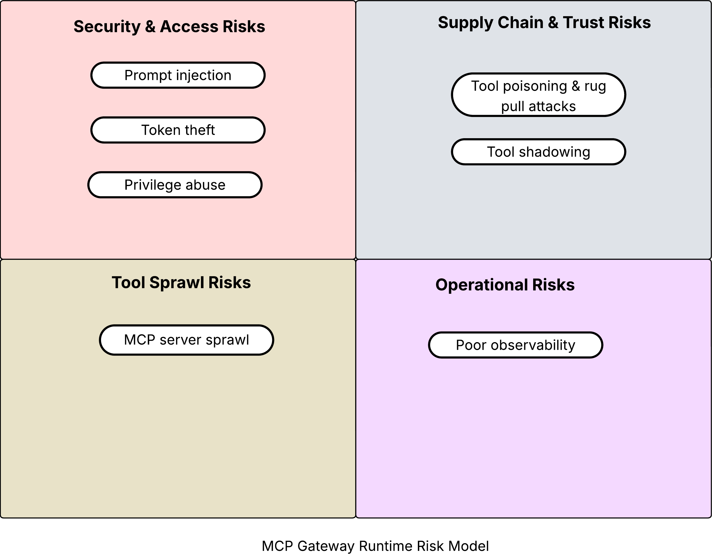

# IGT-AI MCP gateway risk model

Using MCP servers exposes organizations to the following categories of risks.

- Security risks
- Supply chain and trust risks
- Discovery risks
- Operational risks

 The different risks in these categories are illustrated below.

In the sections below, for each risk category, I describe the specific risks and risk mitigation mechanisms at the AI gateway layer.

### Security and access risks

---

#### Prompt injection
Attackers can use malicious inputs (directly or via external data) to trick an agent into executing harmful, unintended actions through an MCP server, such as calling a dangerous tool or overriding safety policies. 

#### Token theft
A compromised MCP server can lead to the theft of high-value secrets like OAuth tokens and API keys, granting attackers persistent access to connected services. 

#### Lack of authn / authz

#### Privilege abuse
A malicious request from a user can trick an MCP server into accessing resources that the user should not have access to, violating security boundaries. 

### Supply chain and trust risks

---

#### Tool poisoning and rug pull attacks

#### Tool shadowing

### Operational risks

---

### Tool Sprawl Risks

---
