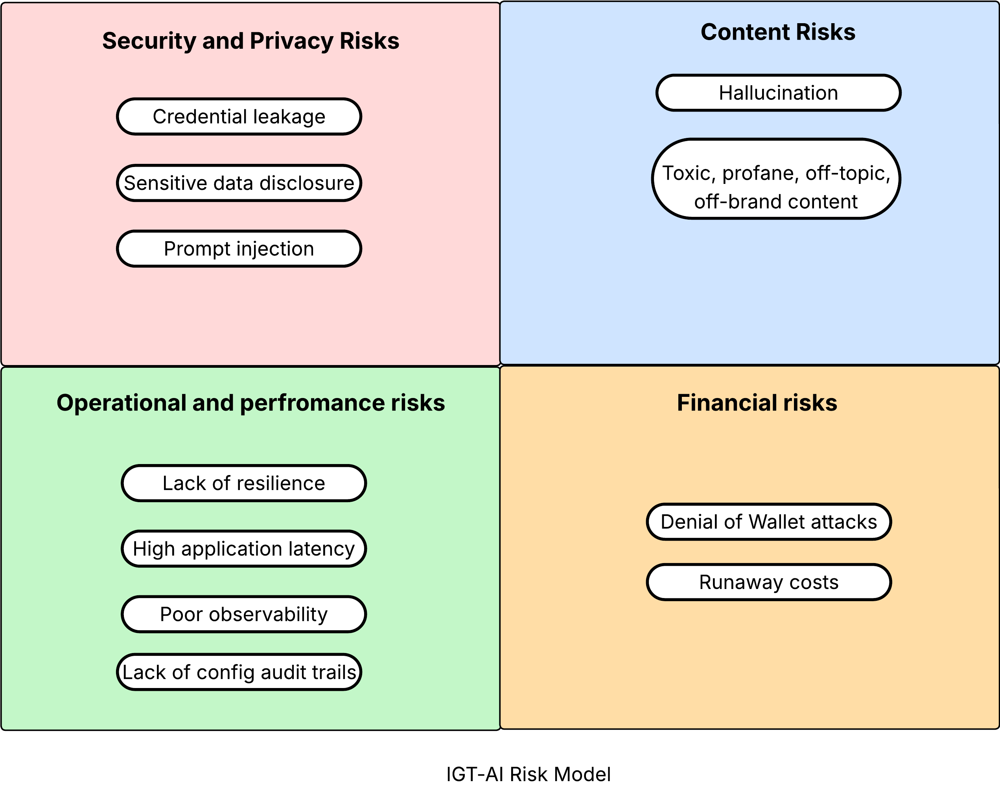

# IGT-AI risk model

Consuming AI APIs exposes organisations to the following categories of risks.

- Security and privacy risks
- Content risk
- Operational and performance risks
- Financial risks

The different risks the IGT model covers within these categories are illustrated below.

### Security and privacy risks

---

#### Credential leakage

API keys and other credentials used to access AI APIs can be leaked through
code repositories or logs, allowing unauthorized access
to AI services.

#### Sensitive data disclosure

When sending data to AI APIs, sensitive information may be inadvertently
included in requests to the LLM. Also, the LLM can also be tricked by an attacker into disclosing sensitive data, leading to potential data breaches or compliance
violations. Example of sensitive data includes Personally Identifiable Information (PII),
Protected Health information (PHI), financial data, or proprietary business
information.

#### Prompt injection

Malicious actors can manipulate prompts sent to AI APIs to produce harmful or
unintended outputs, leading to misinformation by the model, offensive content,
or security vulnerabilities.

### Content risk

---

#### Hallucination

AI models may generate incorrect or fabricated information, which can mislead
users or result in poor decision-making.

#### Toxic, profane, off-topic, and off-brand content

Attackers can send queries that are irrelevant to the business
or out-of scope of the generative AI application.
A model can produce outputs that are biased, offensive, or harmful, damaging the
organization's reputation and user trust. This includes vulgar, profane, or
offensive language, hate speech, gratuitous violence, bullying, sexually
explicit content, or any content that's inconsistent with the brand's voice
and values.

---

### Operational and performance risks

#### Lack of resilience

An inference service may become unavailable due to high demand, outages, or
other issues, impacting application functionality.

#### High application latency

AI APIs can introduce latency into applications, especially if the API
provider experiences high demand or outages, impacting user experience. Delays
between user input and model input can lead to user frustration and reduced
engagement.

#### Poor observability

Without proper logging, monitoring, and tracing of AI API calls, it can be
challenging to diagnose issues and understand usage patterns.

#### Lack of config audit trails

Unclear who made what configuration changes, when, and why. This can lead to
accountability issues and challenges in troubleshooting problems.

### Financial risks

---

#### Denial of wallet attacks

Attackers can exploit AI APIs by sending a high volume of requests, leading to
unexpected costs and potential service disruptions.

#### Runaway costs

Without proper monitoring and controls, normal usage of AI APIs can lead to
significant and unexpected expenses. This risk is also referred to as unbound consumption.

---

## Other AI consumption risk models

- [OWASP Top 10 for LLM Applications 2025](https://genai.owasp.org/llm-top-10/)
- [Google Secure AI Framework](https://saif.google/secure-ai-framework/risks)
- [FINOS AI Governance Framework](https://air-governance-framework.finos.org/)